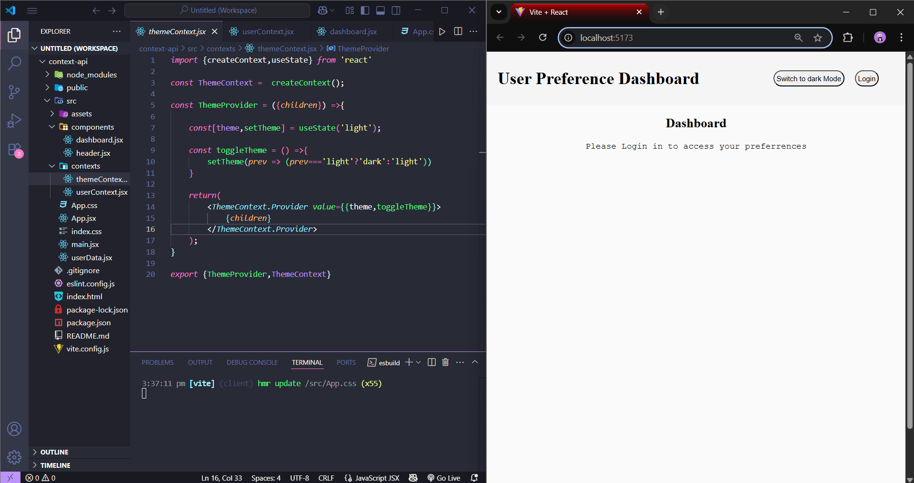
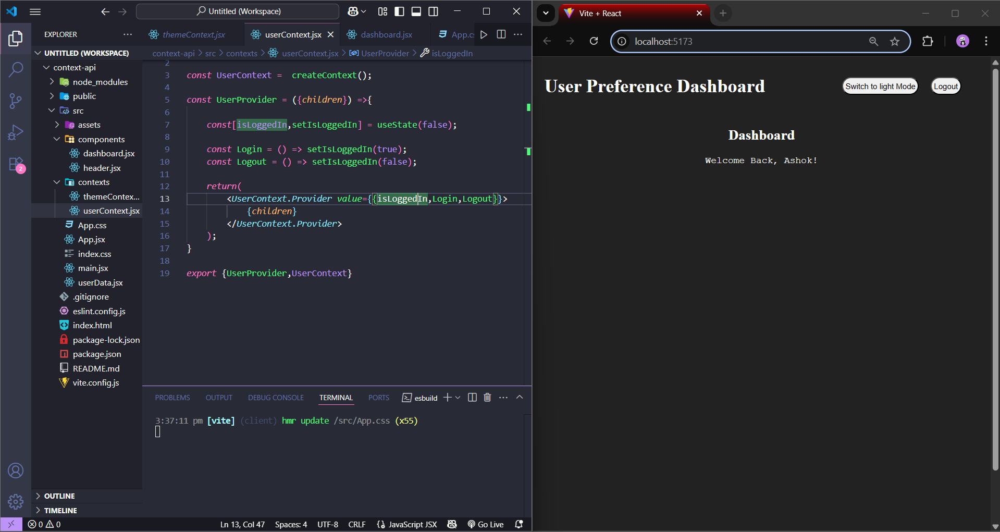

# React Context API

Developed a small project titled "User Preferences Dashboard" that manages theme (light/dark) and user login state using React's Context API. 

Two separate contexts were created — ThemeContext for theme management and UserContext for handling login status. 

The app includes a simple login/logout feature, where the authentication state is maintained in context and shared across components. 

The entire application is wrapped in both context providers to ensure global access to user and theme data.

# #REACT #CONTEXT_API

Output Screehshot

